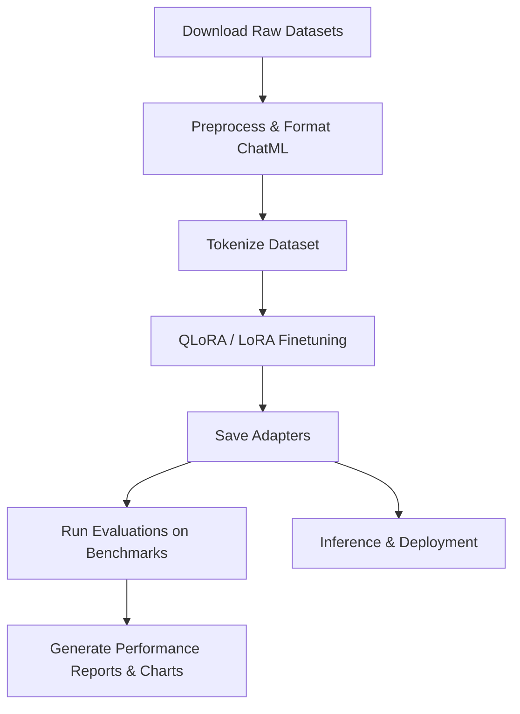

# Coding Assistant

A comprehensive project for LLM finetuning, training, evaluation, and inference.

## Project Structure

```
coding-assistant
│
├── adapters      # Adapters (e.g. LoRA, QLoRA) for model fine-tuning
├── benchmark     # Benchmarking tools and datasets
├── datasets      # Data preparation and ingestion pipelines
├── docs          # Project documentation
├── evaluation    # Evaluation scripts and metrics
├── inference     # Deployment and real-time generation scripts
├── models        # Base model files or configuration
├── outputs       # Logs, checkpoints, and export artifacts
├── rag           # Retrieval-Augmented Generation implementation
├── scripts       # Helper scripts and automation
└── training      # Fine-tuning and training scripts
```

## Hardware & Training Time Analysis

This analysis outlines SFT dataset details and hardware resource scaling performance when training a **DeepSeek-Coder 6.7B** model with LoRA / QLoRA fine-tuning.

### 1. Dataset Scale
To train the model fully across SFT stages (1 epoch):

| Dataset | Split | Purpose | Examples Count |
| --- | --- | --- | --- |
| **OpenCoder Stage 1** | Train | Foundational Coding SFT | ~400,000 |
| **OpenCoder Stage 2** | Train | Advanced Reasoning SFT | 436,347 |
| **CodeAlpaca** | Train | Instruction-Following Tuning | 20,022 |
| **ClassEval** | Eval/Test | Class-Level Code Generation Eval | 100 |
| **Total Pipeline Data** | - | - | **~856,469 examples** |

---

### 2. Hardware Resource & Time Projections (512 Sequence Length)

Fine-tuning a 6.7B model on different GPU configurations yields the following estimated training times for **1 epoch**:

#### RTX 4050 Laptop GPU (6 GB VRAM)
* **Optimization Setup**: QLoRA (4-bit quantization), Gradient Checkpointing active, `batch_size = 1`.
* **Throughput**: ~11.25 seconds per example (due to massive memory swapping and checkpointing recomputations).
* **Estimated 1 Epoch Time**: **~111 days** (continuous).
* *Note: Local hardware is suitable only for short smoke-tests (e.g. 20 steps).*

#### NVIDIA T4 GPU (16 GB VRAM)
* **Optimization Setup**: QLoRA (4-bit), Gradient Checkpointing active, `batch_size = 4` (or `8`).
* **Throughput**: ~0.17 seconds per example (parallelized execution).
* **Estimated 1 Epoch Time**: **~40 hours** (roughly 1.5 - 2 days).

#### NVIDIA A100 / H100 (80 GB VRAM)
* **Throughput**: ~300 to 500 examples per second.
* **Estimated 1 Epoch Time**: **~30 to 45 minutes**.

---

## Project Architecture & Workflow

The project is structured as an end-to-end LLM fine-tuning and evaluation pipeline. Here is the architectural flow from data preparation to inference:



1. **Data Ingestion & Preprocessing** (`datasets/` & `scripts/`):
   * Downloads raw SFT datasets (OpenCoder, CodeAlpaca, ClassEval).
   * Transforms messages into unified ChatML template formatting (system, user, assistant).
2. **Tokenization** (`training/`):
   * Uses the model's native tokenizer (e.g., DeepSeek-Coder) to pre-tokenize and segment the chat sequences.
   * Caches tokenized results on disk for rapid training reload.
3. **Model Training** (`training/`):
   * Loads the base LLM in 4-bit quantization (QLoRA) using `bitsandbytes` to minimize VRAM footprint.
   * Attaches LoRA target modules to attention weights (`q_proj`, `v_proj`, etc.) and trains on the pre-tokenized dataset.
4. **Evaluation & Benchmarks** (`evaluation/` & `benchmark/`):
   * Runs local evaluation suite using Python AST (`ast.parse`) checking to calculate syntactical code accuracy rates.
   * Compares Base Model vs. Fine-tuned Adapters, exporting reports and visual statistics.
5. **Inference** (`inference/`):
   * Dynamically loads the base model with the trained LoRA adapters merged on top for testing and real-time generation.

---

## How to Run the Project

### 1. Prerequisites & Environment Setup
Make sure you have Python 3.10+ installed. Set up your virtual environment and install the required dependencies:
```cmd
# Create virtual environment
python -m venv .venv

# Activate virtual environment
.venv\Scripts\activate

# Install dependencies (Transformers, PEFT, TRL, BitsAndBytes, Torch, etc.)
pip install -r requirements.txt
```

### 2. Prepare the Datasets
Download and preprocess the OpenCoder Stage 2 dataset to a tokenized format:
```cmd
# 1. Download the datasets
python scripts/download_datasets.py

# 2. Format the datasets into ChatML messages and inspect them
python scripts/inspect_dataset.py processed/opencoder_stage2_chat

# 3. Pre-tokenize the dataset using DeepSeek-Coder tokenizer
python training/tokenize_dataset.py
```

### 3. Run Fine-Tuning (Stage 1 Smoke Test)
Run the QLoRA training task. To perform a full training run, edit the `smoke_test` settings inside `train_stage1.py`:
```cmd
python training/train_stage1.py
```

### 4. Run Evaluation Benchmarks
Once training finishes, you can benchmark the base model and your adapter:
```cmd
# Evaluate the base model
python evaluation/run_eval.py --model base

# Evaluate the trained adapter
python evaluation/run_eval.py --model adapter

# Compare results and output a Markdown comparison report (result.md)
python evaluation/compare_results.py
```

### 5. Running Custom Inference
Test the trained adapter directly with custom prompts using the inference module:
```cmd
python inference/test_model.py
```


